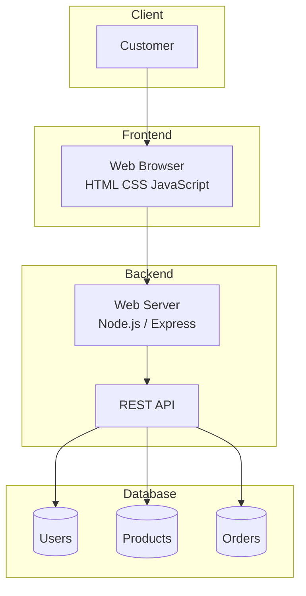

## System Architecture

PrimePC ใช้สถาปัตยกรรมแบบ **3-Tier Architecture** โดยแบ่งระบบออกเป็น 3 ส่วนหลัก ได้แก่ Frontend, Backend และ Database เพื่อให้ระบบมีโครงสร้างที่ชัดเจน สามารถพัฒนา ดูแลรักษา และขยายระบบในอนาคตได้ง่าย

