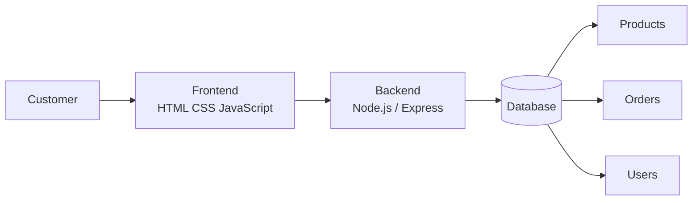

## Analysis & Design

### Frontend
- พัฒนาเว็บไซต์ด้วย HTML, CSS และ JavaScript
- แสดงข้อมูลสินค้า รายละเอียดสินค้า และหน้าหลักของระบบ
- ออกแบบให้ใช้งานง่าย (Responsive Design)

### Backend
- จัดการตรรกะการทำงานของระบบ
- รองรับการเชื่อมต่อ API และการจัดการคำสั่งซื้อ
- สามารถพัฒนาด้วย Node.js และ Express

### Database
- จัดเก็บข้อมูลสมาชิก
- จัดเก็บข้อมูลสินค้า
- จัดเก็บข้อมูลคำสั่งซื้อ
## GitHub Pages

https://w0rxph0nx-sos.github.io/PrimePC/

## Repository

https://github.com/w0rxph0nx-sos/PrimePC

---

## System Architecture

